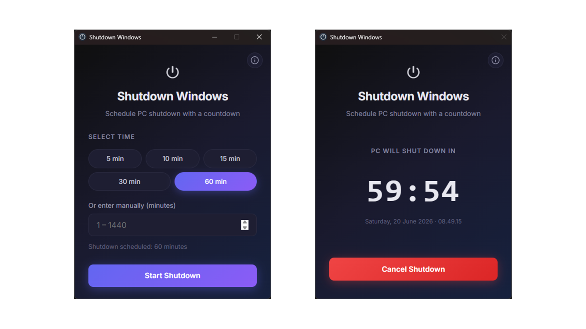

# Shutdown Windows

A simple desktop app to schedule Windows shutdown with a countdown timer.



## Features

- Time presets: 5, 10, 15, 30, 60 minutes
- Manual input (1–1440 minutes)
- Real-time countdown
- Cancel shutdown anytime
- Always-on-top window during countdown

## Prerequisites

- [Node.js](https://nodejs.org/) (LTS)
- [Rust](https://www.rust-lang.org/tools/install)
- [Microsoft C++ Build Tools](https://visualstudio.microsoft.com/visual-cpp-build-tools/) (for Windows)
- WebView2 (included on Windows 10/11)

## Development

```bash
npm install
npm run tauri dev
```

## Build

```bash
npm run tauri build
```

The installer is located at `src-tauri/target/release/bundle/`.

## Notes

The `shutdown /s /t` command is executed by Windows. The countdown continues even if the app is closed — use the **Cancel Shutdown** button to abort it.
